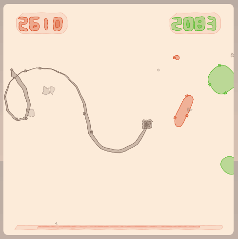

# 🎮 _You have found_ js13k 2020 game - theme 404

[Mark Knol](https://twitter.com/mknol)'s entry for the [js13k gamejam 2020](https://js13kgames.com/).

It's a soothing game about perspective. It's important to turn your sound on, headphones advised. 
Tap and hold to move the trail, make a loop to catch things, if you want.
Should work on desktop and mobile devices.  
It's mostly tested on Chrome, because that's the mother of browsers these days right?

# Post mortem

#### Concept

This is the first time I joined the js13k gamejam. The idea is to create a game in 13kb (zipped). Making games is fun! Not only for the player, but for a developer too. 

> To illustrate how small 13kb is: If you have a iPhone X and you take a selfie, that's 2.93MB, so this game fits 225 times in that. Or, if you have a phone with 64gb of storage, you can have 5.000.000 copies of this game on your phone. 🤯

#### Getting started

To prove to myself it is perfectly possible to use [Haxe](https://haxe.org) for this, I started to create a small engine in Haxe. I called the project hx13k initially. Haxe is a programming languages that compiles to [many languages](https://haxe.org/documentation/introduction/compiler-targets.html), including JavaScript / ES6. 
As main part of my daily job I am game developer and make HTML5 adver games, so I liked the idea of this jam.
First I started by making a basic engine. Or actually, I stripped down this setup I normally use, which is combination of [pixi.js](https://github.com/pixijs/pixi.js) and a customized [Flambe](https://github.com/aduros/flambe) library. 
I am big fan of using Entity/Component and the way the Flambe library did it is how I like to work, it's very pragmatic and usable for creating games. I hoped this wasn't too much of overhead.
Pixi.js was removed as renderer, since it's too big. It's too bad because pixi.js is such a great/fast 2d rendering framework.

I kept stripping the engine until I had the bare minimum (mainloop, entity, components, some utilities).
Then I added my own simple custom canvas [renderer](src/flambe/Renderer.hx). It supports nested hierarchies, which is actually relative easy to achieve with canvas operations.

#### Interaction

I noticed that I needed interaction too (for everything one can tap on), so made simple system to allow object to be tapped.
Now, I don't know how normal people do this in 2d canvas, but I haven't found a native way to do it. So the way I approached it was kinda hacky, but.. it worked out. 
I created another (hidden) canvas pure for interaction. The mainloop iterates each tick on all entities. 
When it finds an DisplayComponent in the hierarchy it will call `display.draw(ctx)` (ctx = 2d context of visual canvas) in the odd frames, but calls a `display.drawInteraction(ctx)` (ctx = 2d context of interaction canvas) in the even frames.
Maybe it could run in the same frame and render the game at 60fps, but I thought to save the planet a bit.

When a display component is created, it will get stored in a static map, by its interaction color. If user taps, I use that position, check the color in the interaction canvas. I look this up in the static map and then I know which display object is tapped. Quick and dirty :)
#### Procedural lines
I had a problem at the beginning of this project, I actually didn't know what game to create. 
At this point I could draw anything I wanted on screen, but yeah, go gotta have an idea eh? 
In my test setup I used some line drawings because that was fastest way to test things. I did decided I wanted to keep that and also use that as main thing in the game. 

I made procedural [art](https://www.curioos.com/markknol) and things in several forms and recently I like creating things on [Turtletoy](https://turtletoy.net/user/markknol). 
Turtletoy allows to create procedural art with JavaScript and outputs lines only using minimal API. There is crazy good/creative stuff there. 
One particular interesting idea I've seen there is a so called "[Tortoise](https://turtletoy.net/turtle/102cbd7c4d)", I adapted the idea behind this for this game. 
It basically takes an array of transformers, a transformer takes gets a point in and can return a modified point. Stacking this on top of eachother and doing this before actually drawing allows creating complex looking effects.
The game is mostly build of lines. So I developed a system where lines have start- and update modifiers, which take a path in and return a modified path. 
Start modifiers are applied once and are permanent, update modifiers are temporary applied each frame, just before it draws.

#### Object in loop collision detection

The detections kinda works like this:

- The snake is build out of segments
- Check if a segment of the snake collides with another segment. If so, there is a loop.
- Using random sampled points in range of this loops first/last segment, a few line segments are created.
- If these line segments hit the objects that float in space, there is the collision.

The collision is not super accurate because it uses random, but it's good enough™ and isn't very heavy.

#### Make everything small

Haxe allows generalized metaprogramming, which they call [macros](https://haxe.org/manual/macro.html). The project contains some macros to increase development fun, avoid boilerplate code and reduce filesize. All macro's run in the same compile step, so I don't need to call any external tool or something, it is integrated. For example I created a [small macro](src/game/display/PathMacro.hx) that takes the [SVG files](./svg/) and inject them in the code as an array with integers, which is converted to vectors in runtime. The internal presentation of the text/numbers are actually quite small, they are made fancy with the procedural step I add afterwards. For example this is how it looks internally (left) and how it is presented (right)

I created [build tool](src/BuildTool.hx) (a macro that runs after compilation is done) that logs sizes and creates the final zip-file. The build tool calls [terser](https://www.npmjs.com/package/terser) to minify the build but I also manually replaced some tokens after that in the same macro.

I added the [no-spoon](https://github.com/back2dos/no-spoon/) library (also macro) to replace `Std.string`; this is Haxe's build-in to-string function that is consistent over all Haxe targets, but adds quite some boilerplate code. I don't need this, so I replaced it with something that just returns itself.

This is the final code:

* The renderer/entity/component system is ~7kb minified, ~3kb zipped.
* The actual scenes / game is ~27kb minified, ~8.5kb zipped.
* The numbers are the SVG data, which are the numbers and text from the intro. 

Haxe is pretty great for this actually! I can write normal Haxe code, all fields become small names because of my [Haxe obfuscator](https://github.com/markknol/hxobfuscator) lib. 
I noticed that standard Haxe enums take some space in the output because they can also hold enum values. In most cases it was small change to change that too `enum abstracts`, which is basically comes down to a enum in TypeScript (`<ad>But with more features! E.g. functions can be added or implicit casting functions. Even operator overloading is supported! And no one notices when looking at the final output because it is all inlined!</ad>`).

In debug builds I can add nice stuff for development (using conditional compilation) and the release build those things are gone and it is very optimized/small.

#### Entity / Component 

I used the [entity](https://github.com/markknol/flambe-guide/wiki/Entities)/[component](https://github.com/markknol/flambe-guide/wiki/Components) from Flambe, I removed the  onAdded function, because I didn't use it. I've a useful macro that consumes the metadata `@:component` which can be applied on fields, e.g. `@:component var display:DisplayComponent;`. This does automagically injects `if (display != null) { display = owner.get(DisplayComponent); Assert(display != null, "Game.display cannot be null"); }` in the `onStart()` method. This avoids boilerplate code and is very usable in all game projects that use this entity/component setup, because its readable on which component it depends. In release builds, Assert's are entirely removed. One can also use `@:component(parents)` which does `owner.getFromParents()` or `@:component(children)` or `@:component(optional)` to skip the assert. This is a slight overhead maybe but I think was worth keeping.

#### Conclusion

All the goodness of Haxe can be used to create a nice and small game. It was fun to join this jam! ⭐⭐⭐⭐⭐

# Locally test/compile game 

 * `yarn install` (or `npm`) to install the dependencies. This will locally install [Haxe](https://haxe.org) and its dependencies.
 * `yarn build:debug` to create debug build.
 * `yarn build:release` to create release build (minified, zipped). This only works on Windows because it uses `ect-0.8.3.exe`.
